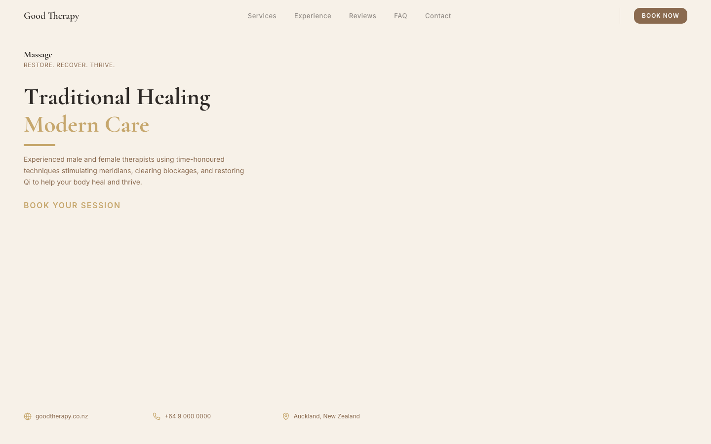

# Alae Ddine

**KI Architekt · AI Automation Engineer · Web Developer**

I build AI automation systems, business websites, and production-ready tools — from n8n agent workflows to premium client-facing web experiences.

---

## Featured Work

### Web Projects

| Project | Description | Live |
|---------|-------------|------|
| [**Good Therapy**](https://github.com/alaeddineyettou-design/web-portfolio/tree/main/projects/good-therapy) | Auckland massage therapy clinic — online booking, 9 services, premium wellness brand | [Visit →](https://good-therapy-pearl.vercel.app/) |

[View full web portfolio →](https://github.com/alaeddineyettou-design/web-portfolio)

### AI & Automation

| Project | Description |
|---------|-------------|
| [**n8n AI Automation Portfolio**](https://github.com/alaeddineyettou-design/n8n-ai-automation-portfolio) | 161 production-style AI agent workflows across 13 categories |
| [**NEXAFLOW AI Automation**](https://github.com/alaeddineyettou-design/nexaflow-ai-automation) | Advanced business automation platform |
| [**Token Intelligence Terminal**](https://github.com/alaeddineyettou-design/token-intelligence-terminal) | Real-time Solana token monitoring dashboard |

---

## Skills

`AI Agents` · `n8n` · `React` · `Vite` · `Tailwind CSS` · `Vercel` · `Solana` · `RAG` · `Voice AI` · `Automation`

---

## GitHub Stats

---

## Connect

- **GitHub:** [@alaeddineyettou-design](https://github.com/alaeddineyettou-design)
- **Web Portfolio:** [web-portfolio](https://github.com/alaeddineyettou-design/web-portfolio)

---

*Building intelligent systems and polished web experiences.*
